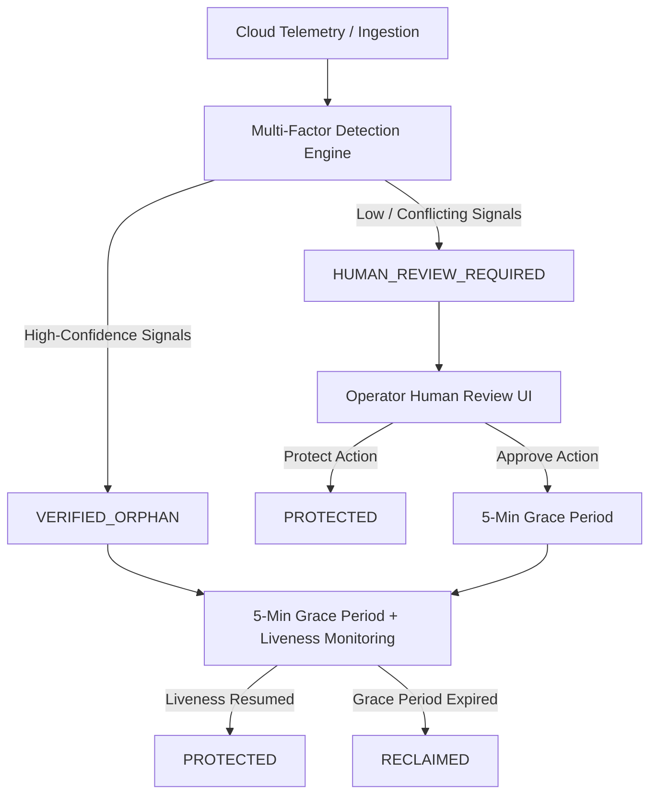
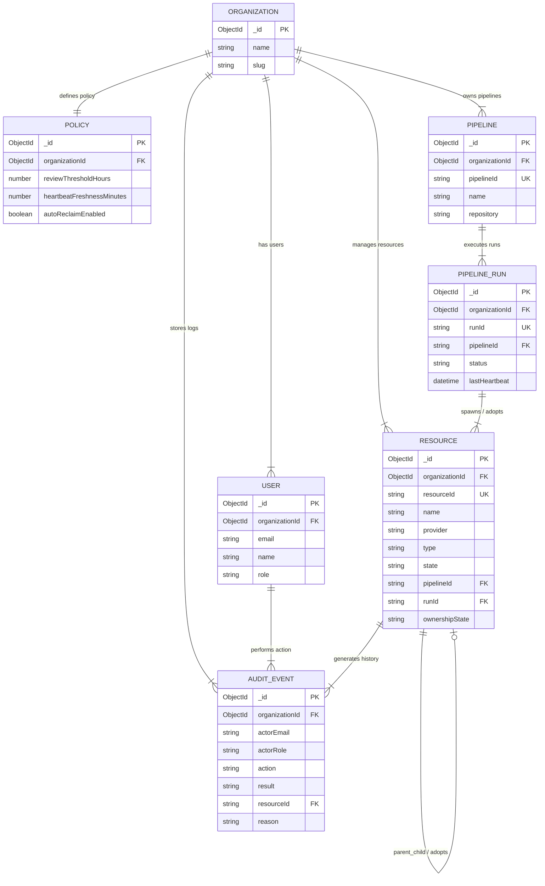

# 🛡️ OrphanCleanup — Real-Time Ephemeral Resource Safety & Leak Prevention Platform

Production-grade real-time ephemeral resource lifecycle management and leak prevention platform built for cloud infrastructure engineering, DevOps, and municipal cloud operations environments. Powered by Node.js, Express.js, MongoDB, Mongoose ORM, React 18, Vite, and Google Gemini Advisory AI Engine.

---

## 📋 Table of Contents
- [1. Architecture Overview & Diagrams](https://github.com/adithyaqwe/orphan-cleanup#1-architecture-overview--diagrams)
  - [A. High-Level System Architecture (Flow & Decision)](https://github.com/adithyaqwe/orphan-cleanup#a-high-level-system-architecture-flow--decision)
  - [B. Database Data Model & Entity Specifications](https://github.com/adithyaqwe/orphan-cleanup#b-database-data-model--entity-specifications)
  - [C. Dual Telemetry Stream Pipeline](https://github.com/adithyaqwe/orphan-cleanup#c-dual-telemetry-stream-pipeline)
  - [D. 12-Stage Resource Triage & Reclamation Sequence](https://github.com/adithyaqwe/orphan-cleanup#d-12-stage-resource-triage--reclamation-sequence)
- [2. AI Safety Triage & Recommendation Matrix](https://github.com/adithyaqwe/orphan-cleanup#2-ai-safety-triage--recommendation-matrix)
- [3. Key Architectural Patterns](https://github.com/adithyaqwe/orphan-cleanup#3-key-architectural-patterns)
- [4. Environment Variables Configuration](https://github.com/adithyaqwe/orphan-cleanup#4-environment-variables-configuration)
- [5. Local Development Setup Guide](https://github.com/adithyaqwe/orphan-cleanup#5-local-development-setup-guide)
- [6. Project Directory Structure](https://github.com/adithyaqwe/orphan-cleanup#6-project-directory-structure)
- [7. REST API Reference & Real-Time Events](https://github.com/adithyaqwe/orphan-cleanup#7-rest-api-reference--real-time-events)
- [8. Security & Operational Guardrails](https://github.com/adithyaqwe/orphan-cleanup#8-security--operational-guardrails)
- [9. Verifiable Audit Trail & Compliance Logs](https://github.com/adithyaqwe/orphan-cleanup#9-verifiable-audit-trail--compliance-logs)

---

## 1. Architecture Overview & Diagrams

OrphanCleanup translates complex cloud telemetry and pipeline signals into triaged infrastructure safety profiles, identifies orphaned temporary servers and apps, enforces a 5-minute grace period with continuous liveness monitoring, and provides human-in-the-loop fallback for ambiguous resources.

### A. High-Level System Architecture (Flow & Decision)



### B. Database Data Model & Entity-Relationship (ER) Diagram
The system maintains 6 core entities in MongoDB via Mongoose ORM: `Organization`, `User`, `Policy`, `Pipeline`, `PipelineRun`, `Resource`, and `AuditEvent`.



#### Database Table / Collection Specifications

| Collection | Primary Key / Indexes | Description |
| :--- | :--- | :--- |
| **Resource** | `_id` (ObjectId), `resourceId` (Unique String), `state` | Telemetry records, ownership states, agent heartbeats, workload operations, detection evidence, human review states, and cleanup states. |
| **Pipeline** | `_id` (ObjectId), `pipelineId` (Unique String) | CI/CD preview builder pipeline configurations and repository metadata. |
| **PipelineRun** | `_id` (ObjectId), `runId` (Unique String), `status` | Pipeline execution runs (`ACTIVE`, `CRASHED`, `FAILED`), owner assignments, and adopted resource IDs. |
| **AuditEvent** | `_id` (ObjectId), `organizationId`, `timestamp`, `action` | Immutable audit trail tracking detection evaluations, safety gatekeeper checks, human decisions, and reclamation events. |
| **User** | `_id` (ObjectId), `email` (Unique String), `role` | Authorized accounts with Role-Based Access Control (`ADMIN`, `OPERATOR`, `VIEWER`). |
| **Policy** | `_id` (ObjectId), `organizationId` | Organizational safeguards (protected environments, resource type protections, threshold hours). |

### C. Dual Telemetry Stream Pipeline
- **Cloud Intake & Detection Stream**: Ingests resource telemetry (`resourceId`, `type`, `creationTime`, `ownershipState`, `metricsCount`), executes structured Gemini AI analysis, evaluates multi-factor safety rules, and assigns lifecycle state (`PROTECTED`, `VERIFIED_ORPHAN`, `HUMAN_REVIEW_REQUIRED`).
- **Liveness Monitoring & Grace Stream**: Monitors background grace periods, re-verifies process liveness prior to deletion, and executes automatic *Caught & Reversed* safety reversals if activity resumes.

### D. 12-Stage Resource Triage & Reclamation Sequence
```text
1. Resource Ingested ──> 2. Structured Multi-Factor Eval ──> 3. Gemini AI Advisory Analysis
                                                                    │
6. Human Review Alert Raised <── 5. Low / Conflicting Metrics <── 4. Deterministic Safety Check
        │
        ▼
7. Operator Review / Approval ──> 8. 5-Min Grace Period Scheduled ──> 9. Continuous Liveness Check
                                                                    │
12. Safe Deletion Finalized <── 11. Caught & Reversed Safeguard <── 10. Pre-Reclamation Liveness
```

---

## 2. AI Safety Triage & Recommendation Matrix

OrphanCleanup utilizes a structured JSON prompt schema with Google Gemini Advisory AI, paired with a deterministic local rule-based fallback safety classifier:

| Resource Type | Default Priority | Safety Standard | Required Telemetry Signals | Immediate Action Standard |
| :--- | :--- | :--- | :--- | :--- |
| **Active Build Worker** | PROTECTED | High Confidence | Active Pipeline Run, Verified Owner | Protect resource; no cleanup allowed |
| **Adopted Child Pod** | PROTECTED | High Confidence | Active Adoption Link (`isAdopted: true`) | Preserve adopted pod under new runner |
| **Unresponsive Heartbeat + 18 Ops** | HUMAN_REVIEW_REQUIRED | Operator Fallback | Present but unresponsive heartbeat, 18 ops | Block auto-delete; raise Human Review Alert |
| **Crashed Build Server** | VERIFIED_ORPHAN | 5-Min Grace Period | Crashed Run, No Owner, 0 Ops, Stale Heartbeat | Schedule 2-Phase reclamation |
| **Production Storage** | PROTECTED | Production Rule | Environment `production` / Tag `protected` | Auto-exclude from reclamation |
| **Unclaimed Volume** | NEEDS_REVIEW | Operator Fallback | Unclaimed owner, low activity | Flag for operator manual review |

---

## 3. Key Architectural Patterns

- **Human-in-the-Loop Safety Fallback System**:
  > **"WHEN THE SYSTEM IS UNCERTAIN, IT DOES NOT DELETE — IT ASKS A HUMAN."**
  If workload metrics are ambiguous ($0 < \text{ops} \le 50$), evidence conflicts, AI advice conflicts with safety rules, or owner is unconfirmed, automatic deletion is strictly blocked and a **Human Review Alert** is raised.
- **Two-Phase Reclamation & Liveness Monitoring**: Initiates a 5-minute grace period with continuous liveness monitoring. If workload activity resumes before deletion, reclamation is automatically **caught and reversed** back to `PROTECTED`.
- **Fail-Safe AI Degradation Pipeline**: If `GEMINI_API_KEY` is absent or WAN connectivity drops, the system seamlessly degrades to deterministic local safety rules with 100% zero downtime guarantee.
- **Pure JavaScript & ESM Module Architecture**: Written in clean ESM JavaScript (`.js` / `.jsx`) for rapid iteration, maximum bundler speed, and zero compilation friction.
- **Interactive EOC Command Cartography**: Integrates high-performance glassmorphic UI, real-time analytics hub, state distribution charts, and interactive topology graphs.

---

## 4. Environment Variables Configuration

### Backend Environment Configuration (`backend/.env`)

| Variable | Required | Description | Default / Example |
| :--- | :---: | :--- | :--- |
| `PORT` | Yes | Express REST API server listening port | `5000` |
| `MONGO_URI` | Yes | MongoDB database connection URI | `mongodb://localhost:27017/orphan-cleanup-db` |
| `JWT_SECRET` | Yes | Secret key for signing JWT authentication tokens | `your-secret-key` |
| `GEMINI_API_KEY` | Optional | Google Gemini AI API key for call classification | `AIzaSy...` |

### Frontend Environment Configuration (`frontend/.env`)

| Variable | Required | Description | Default / Example |
| :--- | :---: | :--- | :--- |
| `VITE_API_BASE_URL` | Yes | Base URL connecting to Express API | `http://localhost:5000` |

---

## 5. Local Development Setup Guide

### Prerequisites
- **Node.js**: v18.0.0 or higher
- **npm**: v9.0.0 or higher
- **MongoDB**: Local MongoDB community server running on port 27017 or MongoDB Atlas URI

### Step 1: Clone Repository & Install Dependencies
```bash
git clone https://github.com/adithyaqwe/orphan-cleanup.git
cd orphan-cleanup

# Install Backend Dependencies
cd backend
npm install

# Install Frontend Dependencies
cd ../frontend
npm install
```

### Step 2: Start Development Servers

In Terminal 1 (Backend Server & API Engine):
```bash
cd backend
npm run dev
# Express API running on http://localhost:5000
# Database connected & initial scenario seeded
```

In Terminal 2 (React + Vite Frontend App):
```bash
cd frontend
npm run dev
# Vite Web App running on http://localhost:5173
```

---

## 6. Project Directory Structure

```text
orphan-cleanup/
├── README.md                  <-- Master architectural handbook & system manual
├── ARCHITECTURE.md            <-- Deep-dive architecture design document
├── backend/                   <-- Node.js / Express.js REST API Server
│   ├── package.json
│   ├── tests/
│   │   └── humanReview.test.js <-- 11 Human-in-the-Loop safety test scenarios
│   └── src/
│       ├── cleanup/           <-- Two-phase reclamation & concurrency locking engine
│       ├── controllers/       <-- HTTP route handlers (resources, cleanup, auth)
│       ├── detection/         <-- Multi-factor detection engine & AWS ingestion
│       ├── middleware/        <-- Auth, RBAC (ADMIN/OPERATOR/VIEWER), rate limiters
│       ├── models/            <-- Mongoose schemas (Resource, AuditEvent, User, etc.)
│       ├── routes/            <-- Express route definitions
│       ├── security/          <-- Deterministic safety engine & gatekeepers
│       ├── services/          <-- Seed service & auto-cleanup background worker
│       └── server.js          <-- Express server entry point
└── frontend/                  <-- Enterprise React 18 + Vite Web Application
    ├── index.html
    ├── vite.config.js
    └── src/
        ├── App.jsx            <-- Master EOC Command Center layout container
        ├── components/        <-- Status badges, modals, tooltips, buttons, banners
        ├── context/           <-- Authentication context & role providers
        ├── pages/
        │   ├── CleanupCenterPage.jsx  <-- Human Review Section, Grace Period & Audit
        │   ├── DashboardPage.jsx      <-- Analytics hub & countdown scanner
        │   ├── InventoryPage.jsx      <-- 360-degree resource inventory
        │   └── ResourceDetailPage.jsx <-- Single resource telemetry & actions
        └── services/
            └── api.js         <-- Live Axios API client with JWT support
```

---

## 7. REST API Reference & Real-Time Events

### REST API Endpoints

| Method | Endpoint | Description |
| :--- | :--- | :--- |
| **GET** | `/api/health` | Server liveness & status check |
| **POST** | `/api/auth/login` | User authentication & HTTP-Only cookie JWT issuance |
| **GET** | `/api/resources` | List all resources with filters (`state`, `search`) |
| **GET** | `/api/resources/:id` | Fetch 360-degree telemetry & lifecycle history for a resource |
| **POST** | `/api/detection/evaluate/:id` | Run multi-factor detection rules on resource |
| **POST** | `/api/ai/analyze/:id` | Query Advisory AI model for safety recommendation |
| **POST** | `/api/cleanup/human-review/:id/protect` | Protect resource flagged for human review |
| **POST** | `/api/cleanup/human-review/:id/approve-reclaim` | Approve human review reclaim & schedule 5-min grace period |
| **POST** | `/api/cleanup/schedule/:id` | Schedule 5-minute Two-Phase grace period |
| **POST** | `/api/cleanup/finalize/:id` | Finalize reclamation after liveness re-verification |
| **POST** | `/api/cleanup/reverse/:id` | Simulate resumed activity & trigger Caught & Reversed |
| **GET** | `/api/audit` | Retrieve immutable compliance operations audit trail |
| **POST** | `/api/demo/seed` | Seed Golden Scenario dataset into MongoDB |

---

## 8. Security & Operational Guardrails

- **Sanitized AI Input**: Raw telemetry and resource inputs are sanitized before evaluation by Gemini AI to prevent prompt injection.
- **Fail-Safe Response Fallbacks**: Deterministic rule-based safety checks guarantee zero downtime even during WAN network outages.
- **CORS & Cookie Protections**: Express server enforces HTTP-Only JWT cookies and CORS origin restrictions.
- **Role-Based Access Control (RBAC)**:

| Action | ADMIN | OPERATOR | VIEWER |
| :--- | :---: | :---: | :---: |
| View Dashboard & Inventory | ✅ | ✅ | ✅ |
| Run Detection & AI Analysis | ✅ | ✅ | ❌ |
| Protect Human Review Resource | ✅ | ✅ | ❌ (403) |
| Approve Human Review Reclaim | ✅ | ✅ | ❌ (403) |
| Schedule 2-Phase Delete | ✅ | ✅ | ❌ (403) |
| Direct Cloud Reclaim | ✅ | ❌ | ❌ (403) |

---

## 9. Verifiable Audit Trail & Compliance Logs

Every detection evaluation, unit assignment, human operator decision, and reclamation event is recorded in an immutable `AuditEvent` log containing:
- `timestamp`: ISO 8601 millisecond timestamp.
- `actorEmail` & `actorRole`: Email and role of user/system executing action.
- `action`: `HUMAN_REVIEW_PROTECTED`, `HUMAN_REVIEW_RECLAIM_APPROVED`, `RECLAIM_SCHEDULED`, `RECLAIM_REVERSED_LIVENESS_DETECTED`.
- `result`: `SUCCESS`, `BLOCKED`, `FAILURE`, or `OVERRIDDEN`.
- `reason` & `evidence`: Detailed justification array.

Audit logs can be inspected live via the Immutable Operations Audit Trail section in Cleanup Center.
